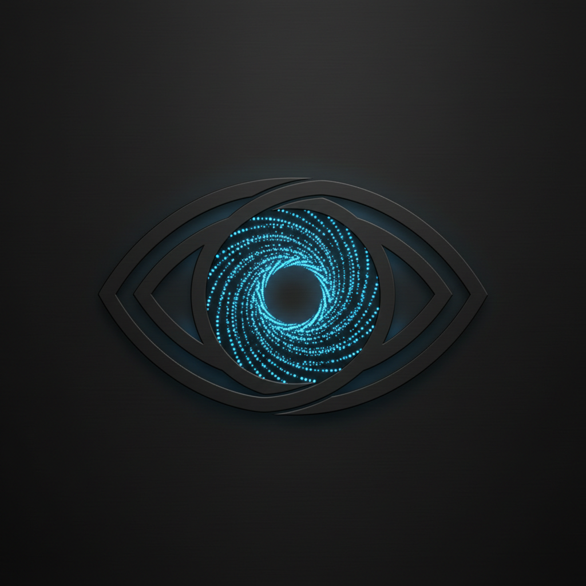

<p align="center">
  
</p>

<h1 align="center">Particlops</h1>

<p align="center">
  <strong>Seamlessly looped particle videos for compositing.</strong><br>
  CLI + GUI &middot; OpenGL 3.3 &middot; Deterministic seeds &middot; 5 built-in presets
</p>

<p align="center">
  
  
  
</p>

---

## Overview

Generate particle animations on a black background, designed to be layered onto other footage with additive or screen blend modes. Every video loops seamlessly via a crossfade export pipeline.

---

<details open>
<summary><strong>Installation</strong></summary>

### Requirements

- Python 3.12
- [uv](https://docs.astral.sh/uv/) (recommended) or pip
- ffmpeg on PATH
- OpenGL 3.3+ GPU

### System dependencies

<details>
<summary>Fedora</summary>

```bash
sudo dnf install ffmpeg mesa-libGL
```
</details>

<details>
<summary>Ubuntu / Debian</summary>

```bash
sudo apt install ffmpeg libgl1-mesa-glx libegl1
```
</details>

<details>
<summary>macOS</summary>

```bash
brew install ffmpeg
```
</details>

### Setup

```bash
git clone https://github.com/Lorakszak/Particlops.git && cd Particlops
uv sync
```

For development tools (pytest, ruff, pyright):

```bash
uv sync --extra dev
```

</details>

---

<details open>
<summary><strong>GUI</strong></summary>

Launch the live preview with sidebar controls:

```bash
uv run particlops preview
```

Load a built-in preset:

```bash
uv run particlops preview --preset stardust
```

Load a custom preset file:

```bash
uv run particlops preview --preset-file my_preset.json
```

The window has:

- **Left panel** -- live OpenGL particle preview at ~60 fps
- **Right sidebar** -- grouped parameter controls (Core, Spawn, Shapes, Physics, Lifecycle, Colors). Changes apply instantly.
- **Export section** -- duration, crossfade, resolution, fps, CRF, output path. Click **Generate** to render in the background.

Presets can be loaded / saved via the buttons at the top of the sidebar.

</details>

---

<details open>
<summary><strong>CLI</strong></summary>

### Basic render

```bash
uv run particlops generate --preset rising_sparks --duration 30 --output sparks.mp4
```

### Full customization

```bash
uv run particlops generate \
  --duration 15 \
  --crossfade 5 \
  --resolution 1920x1080 \
  --fps 60 \
  --crf 18 \
  --particles 3000 \
  --spawn-rate 200 \
  --lifetime 3 \
  --spawn-mode circle \
  --vortex 0.5 \
  --turbulence 0.2 \
  --colors "#ff00ff,#00ffff,#ffff00" \
  --output vortex.mp4
```

### Quick test render

```bash
uv run particlops generate \
  --preset stardust \
  --duration 5 --crossfade 2 \
  --resolution 640x360 --fps 30 \
  --output /tmp/test_loop.mp4

mpv --loop /tmp/test_loop.mp4
```

### Deterministic output

```bash
uv run particlops generate --preset fireflies --seed 42 --output fireflies.mp4
```

</details>

---

<details>
<summary><strong>Presets</strong></summary>

```bash
uv run particlops list-presets
```

| Preset | Description |
|--------|-------------|
| `gentle_snow` | Slow drifting white and blue particles |
| `rising_sparks` | Upward embers with warm orange, red, and yellow |
| `vortex_swirl` | Spiral motion with multi-color particles |
| `stardust` | Gentle outward drift with white, cyan, and purple |
| `fireflies` | Random slow pulsing particles in green and yellow |

### Save / load custom presets

```bash
# Save
uv run particlops generate --preset stardust --vortex 0.3 \
  --save-preset my_preset.json --output out.mp4

# Load
uv run particlops generate --preset-file my_preset.json --output out.mp4
```

</details>

---

<details>
<summary><strong>How the seamless loop works</strong></summary>

The export pipeline runs a single simulation pass rendering `duration + crossfade` total frames:

1. **Pre-roll** -- simulation runs without recording so the screen starts populated
2. **Head frames** (first `crossfade` seconds) -- compressed as PNGs, held in RAM
3. **Middle frames** -- streamed to a lossless intermediate
4. **Tail frames** (last `crossfade` seconds) -- alpha-blended with corresponding head frames

The blended segments are concatenated and encoded to H.264. When the video loops, the last-to-first transition is seamless.

</details>

---

<details>
<summary><strong>CLI reference</strong></summary>

```
particlops generate [OPTIONS]

Core:
  --duration FLOAT       Video length in seconds (default: 30)
  --crossfade FLOAT      Loop overlap in seconds (default: 10)
  --output PATH          Output file path (default: particles.mp4)
  --preset NAME          Built-in preset name
  --preset-file PATH     Path to preset JSON file
  --seed INT             Random seed for reproducibility
  --preroll FLOAT        Pre-roll seconds (default: auto)

Video:
  --resolution WxH       Output resolution (default: 1920x1080)
  --fps INT              Frames per second (default: 60)
  --crf INT              H.264 CRF quality, lower = better (default: 18)
  --codec STR            Video codec (default: libx264)

Particles:
  --particles INT        Max particles alive at once
  --size FLOAT           Base particle size in pixels
  --spawn-rate FLOAT     Particles per second
  --lifetime FLOAT       Seconds per particle
  --spread FLOAT         Spawn velocity spread
  --spawn-mode STR       point | line | circle | edges | random
  --spawn-x FLOAT        Horizontal spawn position (0-1)
  --spawn-y FLOAT        Vertical spawn position (0-1)
  --spawn-radius FLOAT   Radius for circle mode
  --gravity-x FLOAT      Horizontal gravity
  --gravity-y FLOAT      Vertical gravity
  --speed-min FLOAT      Min initial speed
  --speed-max FLOAT      Max initial speed
  --drag FLOAT           Velocity damping
  --turbulence FLOAT     Noise perturbation
  --radial-force FLOAT   Attract/repel from spawn
  --vortex FLOAT         Rotational force
  --size-over-life STR   constant | grow | shrink | pulse
  --fade-curve STR       linear | ease_out | flash
  --color-over-life      Shift through palette over lifetime
  --colors STR           Comma-separated hex colors

Other:
  --save-preset PATH     Save current settings to JSON
```

</details>

---

<details>
<summary><strong>Development</strong></summary>

```bash
uv run pytest tests/ -v       # run tests
uv run ruff check src/ tests/ # lint
uv run pyright src/            # type check
```

</details>

---

<p align="center">MIT License</p>
